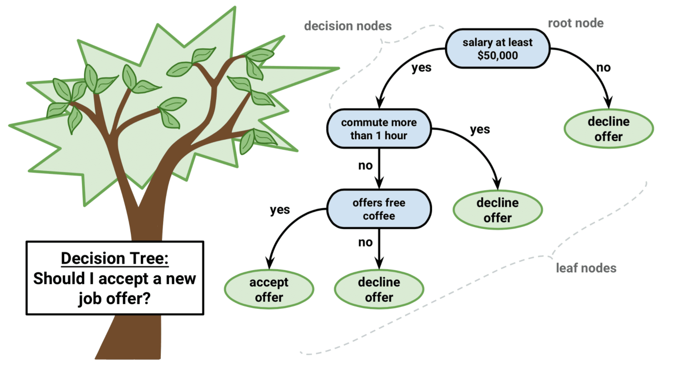

```{r knit-setup, include=FALSE}
knitr::knit_hooks$set(toggle = function(before, options) {
  if(options$toggle) {
    ifelse(before, "<div class='toggle-code'>", "</div>")
  }
})


knitr::opts_chunk$set(echo = TRUE, 
                      toggle = TRUE,
                      cache = TRUE,
                      cache.path = "cache/",
                      fig.align = "center",
                      fig.path = "figures/")

```


 


## load pkg
```{r load_pkg, include=FALSE}
library(tidyverse)
library(reticulate)

#Specify the name of a Conda environment.
use_condaenv(condaenv = "reticulate",
conda = "/Users/zero/anaconda3/bin/conda")

use_python(python = "/Users/zero/anaconda3/envs/reticulate/bin/python3",
required = TRUE)

```


## load data

```{r}
library(ISLR)
library(MASS)
library(tidymodels)
# Boston <- as_tibble(Boston)
Carseats <- as_tibble(Carseats) %>%
  mutate(High = factor(if_else(Sales <= 8, "No", "Yes")))

data <- 
Carseats %>% 
  dplyr::select(-Sales)

data <- data %>% 
  dplyr::mutate(
    High = as.factor(High),
    High = fct_collapse(High,
                        `0` = c("No"),
                        `1` = c("Yes")),
    High = fct_relevel(High,
                       "0",
                       "1"))


```
## split data
```{r}
set.seed(123)
data_split <- initial_split(data, prop = 0.7)

data_train <- training(data_split)
data_test <- testing(data_split)


```

# 🐍 module
```{python}
import IPython
from IPython.display import HTML, display, Markdown, IFrame

from pycaret.classification import *
import pandas as pd               #data loading and manipulation
import matplotlib.pyplot as plt   #plotting
import seaborn as sns             #statistical plotting

```


## r data to python

```{python}
train_data = r.data_train
test_data = r.data_test
train_data.head()
```


## pycaret setup 

[Functions - PyCaret](https://pycaret.org/functions/)

```{python}
clf1 = setup(data=train_data, 
             #data_split_shuffle = False,
             #ignore_features=["ID"],
             target = "High",
             train_size = 0.7,
             feature_selection = True,
             remove_multicollinearity = True,
             normalize=True,
             ignore_low_variance=True,
             session_id=123,
             html = False, silent=True
            )  
```

## auto ML

```{python}
# compare all baseline models and select top 5
top5 = compare_models(n_select = 5) 
# tune top 5 base models
tuned_top5 = [tune_model(i) for i in top5]
# ensemble top 5 tuned models
bagged_top5 = [ensemble_model(i) for i in tuned_top5]
# blend top 5 base models 
blender = blend_models(estimator_list = top5) 
# select best model 
best = automl(optimize = 'Recall')
```

## model compare
```{python}
models()
# 比较所有模型
res_compare_models = compare_models(sort = "AUC")
```


## create and tune model

```{python}
model = create_model('lr')
# 模型调参
model_tuned = tune_model(model, optimize = "AUC", n_iter = 10)
model_tuned

```


## extract data 
```{python}
# 提取数据
data_x = get_config('X')
data_x.head()
data_x.shape
```

## plot metrics

```{python}
# 指标查看 
plot_model(best , plot='auc')
# Hyperparameters         == parameter
# AUC                     == auc
# Confusion Matrix        == confusion_matrix
# Threshold               == threshold
# Precision Recall        == pr
# Prediction Error        == error
# Class Report            == class_report
# Feature Selection       == rfe
# Learning Curve          == learning
# Manifold Learning       == manifold
# Calibration Curve       == calibration
# Validation Curve        == vc
# Dimensions              == dimension
# Feature Importance      == feature
# Feature Importance All  == feature_all
# Decision Boundary       == boundary
# Lift Chart              == lift
# Gain Chart              == gain
# Decision Tree           == tree
```


## 📌 model predict


[Obtaining Transformed Unseen Data · Issue #893 · pycaret/pycaret](https://github.com/pycaret/pycaret/issues/893)

```{python}
unseen_data = test_data
prep_pipe = get_config('prep_pipe')
transformed_unseen_data = prep_pipe.transform(unseen_data)
transformed_unseen_data.shape

```

```{python}
unseen_predictions = test_data

unseen_predictions['Label'] = pd.Series(best.predict(transformed_unseen_data)) 

unseen_predictions['Score'] = pd.Series(best.predict_proba(transformed_unseen_data)[:,1])
```

```{r}
py$unseen_predictions <- 
py$unseen_predictions %>% 
  mutate(Label = as.character(Label))
```


```{python}
from pycaret.utils import check_metric
check_metric(unseen_predictions['High'], unseen_predictions['Label'], metric = 'Accuracy')
```


## model save
```{python eval=FALSE, include=FALSE}
final_model = "final_model"
final_ = finalize_model(model_tuned)
save_model(final_, final_model, verbose=True)
```

# model load
```{python eval=FALSE, include=FALSE}
saved_final= load_model(final_model)
saved_final

```

